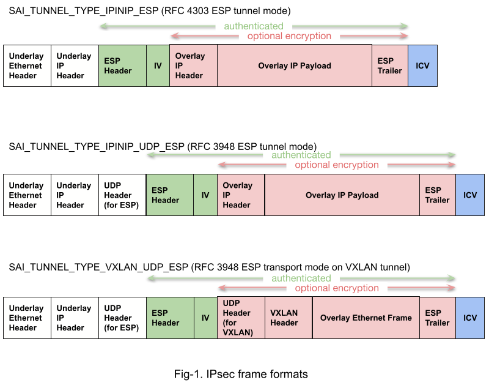
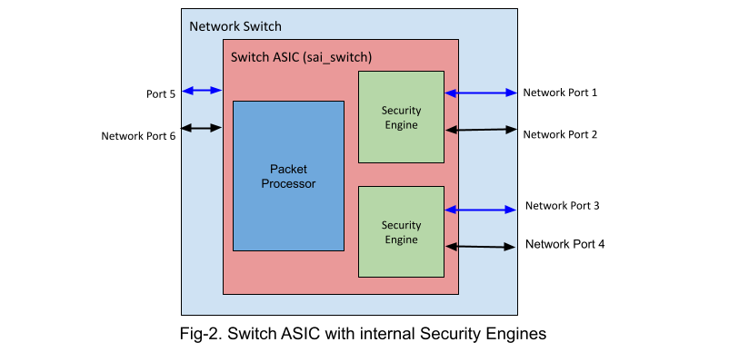
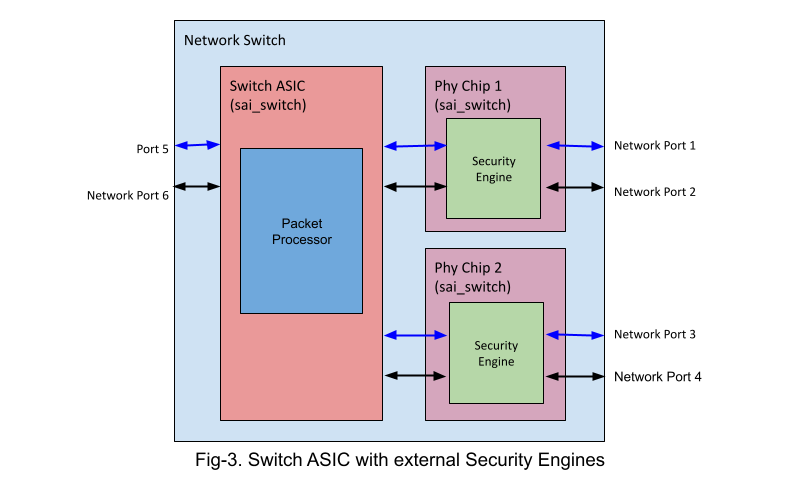
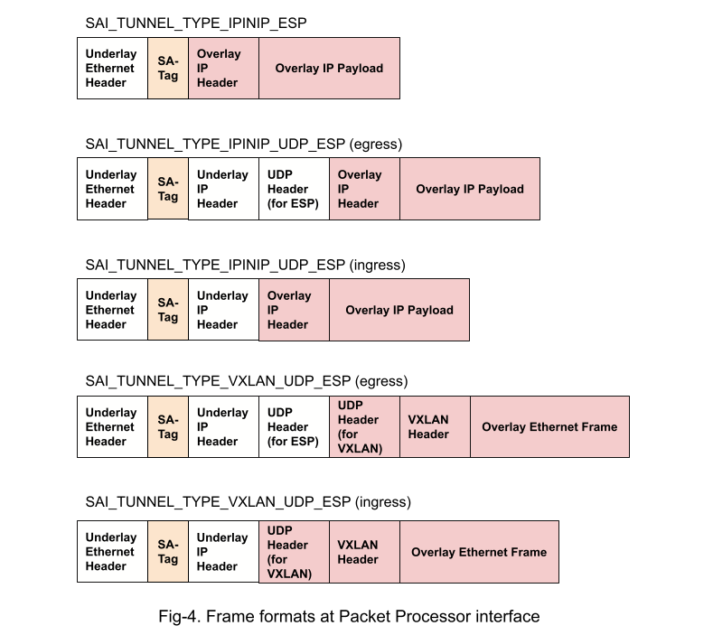
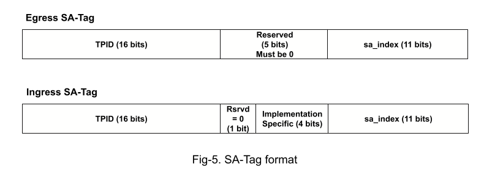
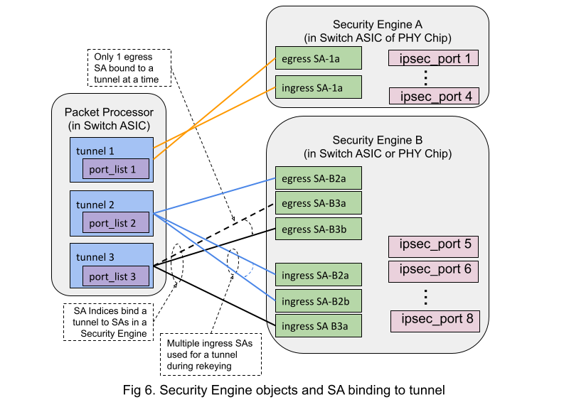

SAI IPsec API Proposal
=====================

Title       | SAI IPsec API Proposal
------------|----------------------
Authors     | Arista Networks, Inc.
Status      | Draft
Type        | Standards track
Created     | 03/18/2021
SAI-Version | ?
-------------------------------

# Scope #

This document defines the technical specifications for the API used to support RFC-4303 IPsec ESP tunnel mode and RFC-3948 UDP-encapsulated IPsec ESP tunnel mode in Open Compute Project Switch Abstraction Interface (SAI).  This API only supports the IPsec datapath security using GCM-AES ciphersuite.  The key exchange protocol is outside the scope of this document and SAI IPsec API.

# Overview #

IPsec secures packets between a pair of end-points identified by a pair of IP addresses.  The switch becomes such an end-point in case it originates and terminates tunnels with another end-point.  So, IPsec in a switch is always associated with tunnel origination and termination.The SAI IPsec API supports 3 such tunneled frame formats described in Fig-1, with the underlay IP header source or destination address identifying this switch.

Packet security includes confidentiality, integrity and authenticity protection.  The SAI IPsec API provides a software interface for related data-path packet transformation, which includes:
1. Egress transformation
   1. Tunnel origination: This includes:
      1. Switching a packet to a IP tunnel
      1. Adding a tunnel header (IP header and optionally a UDP-ESP header).
   1. Egress packet security: This includes:
      1. Adding ESP header and trailer and and the ICV (Integrity Check Value)
      1. Optionally encrypt the packet.
1. Ingress transformation
   1. Ingress packet security: This includes:
      1. Decrypting the tunnel payload and check the integrity and authenticity
      1. Removing the ESP header and trailer and and the ICV. (In one implementation, the UDP-ESP header is also removed here.)
   1. Tunnel termination: This includes:
      1. Removing the tunnel header
      1. Switching the tunnel payload based on the inner packet

Since a Switch ASIC typically performs tunnel termination based only on packet headers, it cannot make use of the Next Header field in the ESP trailer.  So it parses the decrypted payload based on the value of its first nibble as shown in the table below.  This requires the tunnel originator to set to 0 the first nibble of Source Port of the UDP header for VXLAN.

First decrypted nibble | Payload format
-----------------------|----------------------
0                      | Encrypted payload of VXLAN_UDP_ESP format
4	               | IPv4
6	               | IPv6
------------------------------
The tunnel origination and termination functions are performed in the Packet Processor inside the Switch ASIC.  The packet security functions are performed by Security Engines that process packets going between the Packet Processor and the external ports of the Network Switch.
  

In the SAI model, a Network Switch may be composed of a Switch ASIC and multiple PHY Chips, each of which is a separate sai_switch object.  A PHY Chip connects network ports to Switch ASIC ports.  Some network ports may not require a PHY Chip and may be directly connected to Switch ASIC ports.  Each PHY Chip may support a subset of the remaining Switch ASIC ports.  These Switch ASIC ports are connected to network ports through PHY Chip(s).

As shown in the diagrams above, the packet security function for a port may be of one of the following types:
1. Not supported
1. Supported by Security Engine embedded in Switch ASIC
1. Supported by Security Engine embedded in PHY Chip

For each network port, a Security Engine can normally perform either IPsec or MACsec functions, not both.

An integer object named sa_index carried in the packet metadata header associates a tunnel in the Packet Processor with a SA in the Security Engine.  The sa_index value is carried in packet metadata between the Packet Processor and the Security Engine.

In case of Security Engines embedded in the Switch ASIC (as in Fig-2), the format of this metadata is implementation-specific.  In case of Security Engines embedded  in PHY Chips, this is carried in the SA-Tag right after the underlay Ethernet header, as shown in Fig-4.
  

The SA-Tag format is similar to 802.1Q tag and is distinguished by a reserved TPID value that is not used for network traffic.  The egress SA-Tag carries the sa_index to the Security Engine.  The ingress SA-Tag indicates (by its presence) that the data is from a successfully verified IPsec packet.  Both formats are shown in Fig-5.
  

Each Security Engine maintains SA (Security Association) states to secure packets.  For egress, the SA is selected by the sa_index coming from the Packet Processor with the packet.  Some important SA states are the encryption key, the SPI (Security Parameter Index) and the 64-bit IV (Initialization Vector).  For ingress the SA is selected by the SPI value in the encrypted packet header.

The network ports used for IPsec are constrained by the following:
1. Each Security Engine services a subset of network ports.
1. Current hardware does not allow sharing the same egress SA between multiple Security Engines for encryption

Given one egress SA per tunnel, this leads to the following load-balancing constraints in the encrypting switch.

Feature               | Constraints
----------------------|----------------------
Underlay ECMP and LAG | Limited to ports of 1 Security Engine for each tunnel.
Overlay ECMP          | No constraint for overlay ECMP over multiple tunnels.  Each tunnel is limited by the constraints above.
------------------------------------------

# Object Relationships #

IPsec makes use of:
1. saitunnel.h for tunnel definition
1. saiipsec.h for securing the packet

## saitunnel.h changes for IPsec support ##

sai_tunnel_type_t is extended to include 3 encrypted frame formats, as shown in Fig-1.

New attributes are defined for:
1. SAI_TUNNEL_ATTR_SA_INDEX for IPsec egress SA binding
1. SAI_TUNNEL_TERM_TABLE_ENTRY_IPSEC_VERIFIED for checking IPsec verification status in the Packet Processor before terminating IPsec tunnels
1. SAI_TUNNEL_ATTR_SA_PORT_LIST for the list of ports that are programmed with SA for this tunnel

## saiipsec.h ##

This supports the following objects types:
1. sai_ipsec has sai_switch level capabilities and configurations
1. sai_ipsec_port is used for port level IPsec attributes (e.g. packet parsing control, native Vlan Id, etc.)
1. sai_ipsec_sa is used for IPsec Security Associations

Each (line-side) sai_port that supports IPsec encryption/decryption, has an associated sai_ipsec_port object.

Each IPsec tunnel has 2 active ipsec_sa, one for ingress and one for egress.  For each direction (ingress or egress), a new ispec_sa replaces the old one.  The sa_index of the tunnel is changed to switch from the old egress SA to the new one.  After a new ingress_sa is created, both the old and new SA can be active at the same time, selected by SPI in the received packets.

# Function call sequences #
The following sequences assume that sai_tunnel, sai_ipsec and sai_ipsec_port  objects have already been created.

## Create an egress SA and attach its index to a tunnel ##
~~~cpp
// Create egress ipsec_sa
sai_object_id_t ingr_ipsec_sa_id11 = 0ULL;
ipsec_attr_list[0].id = SAI_IPSEC_SA_ATTR_IPSEC_DIRECTION;
ipsec_attr_list[0].value.s32 = SAI_IPSEC_DIRECTION_EGRESS;
 
ipsec_attr_list[1].id = SAI_IPSEC_SA_ATTR_IPSEC_ID;
ipsec_attr_list[1].value.oid = ipsec_id1;

ipsec_attr_list[2].id = SAI_IPSEC_SA_ATTR_IPSEC_SPI;
ipsec_attr_list[2].value.u32 = egr_ipsec_spi1;

ipsec_attr_list[3].id = SAI_IPSEC_SA_ATTR_IPSEC_ENCRYPTION_KEY;
ipsec_attr_list[3].value.macsecsak = egr_ipsec_encryption_key1;
 
ipsec_attr_list[4].id = SAI_IPSEC_SA_ATTR_IPSEC_SALT;
ipsec_attr_list[4].value.u32 = egr_ipsec_salt1;
 
ipsec_attr_list[5].id = SAI_IPSEC_SA_ATTR_IPSEC_AUTH_KEY;
ipsec_attr_list[5].value.macsecauthkey = egr_ipsec_auth_key1;

ipsec_attr_list[6].id = SAI_IPSEC_SA_ATTR_IPSEC_PORT_LIST;
ipsec_attr_list[6].value.objlist = egr_ipsec_port_list1;
 
saistatus = sai_ipsec_api->create_ipsec_sa(&egr_ipsec_sa_id11, 7,
            ipsec_attr_list);
if (saistatus != SAI_STATUS_SUCCESS) {
    return saistatus;
}

// Get sa_index and assign it to the corresponding tunnel
ipsec_attr_list[0].id = SAI_IPSEC_SA_ATTR_SA_INDEX;
saistatus = sai_ipsec_api->get_ipsec_sa_attribute(&egr_ipsec_sa_id11,
1, &ipsec_attr_list);
if (saistatus != SAI_STATUS_SUCCESS) {
    return saistatus;
}
tunnel_attr.id = SAI_TUNNEL_ATTR_SA_INDEX;
tunnel_attr.value = ipsec_attr_list[0].value;

saistatus = sai_tunnel_api->set_tunnel_sa_attribute(&tunnel_id11,
&tunnel_attr);
if (saistatus != SAI_STATUS_SUCCESS) {
    return saistatus;
}
~~~

## Create an ingress SA ##
~~~cpp
// Create ingress ipsec_sa
sai_object_id_t ingr_ipsec_sa_id11 = 0ULL;
ipsec_attr_list[0].id = SAI_IPSEC_SA_ATTR_IPSEC_DIRECTION;
ipsec_attr_list[0].value.s32 = SAI_IPSEC_DIRECTION_INGRESS;  // different from egress
 
ipsec_attr_list[1].id = SAI_IPSEC_SA_ATTR_IPSEC_ID;
ipsec_attr_list[1].value.oid = ingr_ipsec_id1;
 
ipsec_attr_list[2].id = SAI_IPSEC_SA_ATTR_IPSEC_SPI;
ipsec_attr_list[2].value.u32 = ingr_ipsec_spi1;

ipsec_attr_list[3].id = SAI_IPSEC_SA_ATTR_IPSEC_ENCRYPTION_KEY;
ipsec_attr_list[3].value.macsecsak = ingr_ipsec_encryption_key1;
 
ipsec_attr_list[4].id = SAI_IPSEC_SA_ATTR_IPSEC_SALT;
ipsec_attr_list[4].value.u32 = ingr_ipsec_salt1;
 
ipsec_attr_list[5].id = SAI_IPSEC_SA_ATTR_IPSEC_AUTH_KEY;
ipsec_attr_list[5].value.macsecauthkey = ingr_ipsec_auth_key1;

ipsec_attr_list[6].id = SAI_IPSEC_SA_ATTR_TERM_DST_IP;          // only for ingress SA
ipsec_attr_list[6].value.ipaddr = ipsec_term_dst_ip1;
 
ipsec_attr_list[7].id = SAI_IPSEC_SA_ATTR_IPSEC_PORT_LIST;
ipsec_attr_list[7].value.objlist = ingr_ipsec_port_list1;
 
saistatus = sai_ipsec_api->create_ipsec_sa(&ingr_ipsec_sa_id11, 8,
            ipsec_attr_list);
if (saistatus != SAI_STATUS_SUCCESS) {
    return saistatus;
}
~~~

## Remove an SA after collecting its last statistics ##

The steps are identical for ingress and egress.  The following example is for egress.
~~~cpp
// Collect last statistics for SA
saistatus = sai_ipsec_api->get_ipsec_sa_stats_ext(&egr_ipsec_sa_id11,
SA_STATS_COUNT, &ipsec_counter_list, SAI_IPSEC_ATTR_STATS_MODE);
if (saistatus != SAI_STATUS_SUCCESS) {
    return saistatus;
}

UPDATE_EGRESS_SA_STATISTICS(ipsec_counter_list);

// Remove old SA
saistatus = sai_ipsec_api->remove_ipsec_sa(&egr_ipsec_sa_id11);
if (saistatus != SAI_STATUS_SUCCESS) {
    return saistatus;
}
~~~

## Replace egress SA for a tunnel ##

Create a new egress SA and attach its index to a tunnel as described earlier.  The tunnel starts using the new SA and stops using the old SA.

Then find the old SA for that tunnel (from NOS database) and remove it after collecting its last statistics, as described earlier.

## Replace an ingress SA ##

While rekeying, multiple ingress SAs may be active at the same time.  So replacing an SA is includes 2 separate events coordinated with the encryptor by the key exchange protocol:
1. First create a new ingress SA, as described earlier.
1. Later remove the old SA after collecting its last statistics, as described earlier.

# Notes #

## Unsupported Features ##

The SAI IPsec API does not support any interrupt or event notification to NOS.  Possible uses of notification could include:
1. Egress packet number crossing threshold.  The last used egress packet number  can be polled or indirectly inferred from periodically collected egress packet statistics.
1. A new packet SA observed at ingress.  This can be polled to determine when to remove the old SA.

## Hidden Complexities ##
Resources used to implement an IPsec SA resources are shared with MACsec.  These include macsec_flow, macsec_sc and macsec_sa resources, and TCAM resources that  are used to identify tunnel header and SPI.

Multiple ports in different Security Engines have to use the same sa_index for the same tunnel.  Unless all Security Engines are programmed identically for IPsec, this can complicate Security Engine  resource management.
